# ChittyConnect 1Password Integration Architecture

## 🎯 Vision

ChittyConnect evolves into the **single source of truth** for all ChittyOS service credentials, where **ContextConsciousness™** automatically provisions secure access to exactly what's needed, when it's needed, through 1Password's enterprise vault infrastructure.

## 🏗️ Architecture Overview

```mermaid
graph TB
    subgraph "External Clients"
        GPT[Custom GPT]
        Claude[Claude via MCP]
        Service[ChittyOS Service]
        GitHub[GitHub Actions]
    end

    subgraph "ChittyConnect Core"
        API[REST API]
        MCP[MCP Server]

        subgraph "Intelligence Layer"
            CC[ContextConsciousness™]
            MC[MemoryCloude™]
            Analysis[Risk Analysis]
        end

        subgraph "Credential Services"
            CP[Credential Provisioner]
            OP[1Password Provider]
            Cache[KV Cache]
        end
    end

    subgraph "1Password Infrastructure"
        Connect[1Password Connect API]

        subgraph "Vaults"
            Infra[Infrastructure Vault]
            Services[Services Vault]
            Integration[Integrations Vault]
        end
    end

    subgraph "Audit & Monitoring"
        Chronicle[ChittyChronicle]
        D1[D1 Audit DB]
        Metrics[Metrics & Alerts]
    end

    %% Client connections
    GPT --> API
    Claude --> MCP
    Service --> API
    GitHub --> API

    %% API flow
    API --> CC
    MCP --> CC

    %% Intelligence flow
    CC --> Analysis
    CC --> MC
    Analysis --> CP

    %% Credential flow
    CP --> OP
    OP --> Cache
    OP --> Connect
    Connect --> Infra
    Connect --> Services
    Connect --> Integration

    %% Audit flow
    CP --> Chronicle
    CP --> D1
    OP --> Chronicle
    Analysis --> Metrics
```



## 🔐 Security Architecture

### Zero-Trust Credential Management

1. **No Secrets in Code**: All credentials flow through 1Password at runtime
2. **Context Validation**: Every request validated by ContextConsciousness™
3. **Least Privilege**: Minimal scopes based on validated context
4. **Fail Secure**: Deny by default if 1Password unavailable
5. **Audit Everything**: Complete audit trail in ChittyChronicle

### Risk Assessment Pipeline

```typescript
Request → Context Analysis → Risk Scoring → Decision → Audit
         ↓                  ↓              ↓         ↓
    Service Health     Anomaly Detection  Allow/Deny  Chronicle
    Access Patterns    AI Analysis        Provision   Metrics
    Time Analysis      Abuse Detection    Cache       Alerts
```

### Risk Score Thresholds

- **0-29**: Low risk - Auto-approve with standard logging
- **30-49**: Medium risk - Approve with enhanced monitoring
- **50-69**: High risk - Require additional validation
- **70-100**: Critical risk - Deny and alert security team

## 🚀 Implementation Components

### 1. OnePasswordProvider Service
**File**: `/src/services/onepassword-provider.js`

Core capabilities:
- Direct integration with 1Password Connect API
- Context-aware credential retrieval
- Intelligent caching (5-minute TTL)
- Rate limiting (100 requests/hour/service)
- Emergency revocation procedures
- Batch retrieval support

### 2. Enhanced Credential Provisioner
**File**: `/src/services/credential-provisioner-enhanced.js`

Enhanced features:
- Dynamic credential retrieval from 1Password
- Context validation via ContextConsciousness™
- Support for multiple credential types:
  - Cloudflare API tokens (deploy, read, R2, D1)
  - ChittyOS service tokens
  - GitHub deployment tokens
  - Neon database connections
  - OpenAI API keys
  - Notion integration tokens

### 3. Enhanced ContextConsciousness™
**File**: `/src/intelligence/context-consciousness-enhanced.js`

Credential intelligence features:
- Access pattern analysis
- Anomaly detection
- Predictive credential pre-fetching
- Abuse pattern detection
- Risk scoring algorithm
- AI-powered analysis for edge cases
- Learning from access history

### 4. MCP Tools for Claude
**File**: `/src/mcp/tools/credential-tools.js`

Six powerful tools:
1. `chitty_credential_retrieve` - Secure retrieval with context
2. `chitty_credential_provision` - Create scoped credentials
3. `chitty_credential_validate` - Check credential status
4. `chitty_credential_revoke` - Revoke credentials
5. `chitty_credential_audit` - Query audit logs
6. `chitty_credential_health` - System health check

### 5. REST API Proxy Endpoints
**File**: `/src/api/routes/onepassword.js`

Endpoints:
- `POST /api/onepassword/retrieve` - Single credential retrieval
- `POST /api/onepassword/batch-retrieve` - Batch retrieval (max 10)
- `GET /api/onepassword/service-token/:target` - Service tokens
- `GET /api/onepassword/integration-key/:integration` - API keys
- `GET /api/onepassword/health` - Health check
- `POST /api/onepassword/emergency-revoke` - Emergency procedures
- `GET /api/onepassword/insights/:service` - Access insights

## 🗂️ 1Password Vault Organization

### Vault: `chittyos-infrastructure`
```yaml
cloudflare:
  - make_api_key      # Root API key for token creation
  - account_id        # Cloudflare account ID
  - zone_id           # DNS zone ID

github:
  - app_id            # GitHub App ID
  - private_key       # App private key (PEM)
  - webhook_secret    # Webhook validation secret

neon:
  - database_url      # PostgreSQL connection string
  - api_key           # Neon API key
  - project_id        # Neon project ID
```

### Vault: `chittyos-services`
```yaml
chittyid:
  - service_token     # Inter-service auth token
  - drand_api_key     # Drand beacon API key

chittyauth:
  - service_token     # Inter-service auth token
  - jwt_secret        # JWT signing secret
  - encryption_key    # Data encryption key

[other services follow same pattern]
```

### Vault: `chittyos-integrations`
```yaml
openai:
  - api_key           # OpenAI API key
  - org_id            # Organization ID

notion:
  - api_key           # Notion integration token
  - workspace_id      # Workspace identifier

google:
  - client_id         # OAuth client ID
  - client_secret     # OAuth client secret
  - refresh_token     # Long-lived refresh token
```

## 🔄 Migration Strategy

### Phase 1: Setup (Week 1)
1. Deploy 1Password Connect server
2. Create vault structure
3. Populate vaults with existing credentials
4. Deploy enhanced ChittyConnect code
5. Set `ONEPASSWORD_CONNECT_TOKEN` secret

### Phase 2: Testing (Week 2-3)
1. Test each credential type retrieval
2. Validate ContextConsciousness™ risk scoring
3. Verify audit logging to ChittyChronicle
4. Load test with expected traffic patterns
5. Test emergency revocation procedures

### Phase 3: Gradual Migration (Week 4-5)
1. Start with non-critical integrations (Notion, OpenAI)
2. Move to service tokens (inter-service communication)
3. Migrate infrastructure credentials (Cloudflare, GitHub)
4. Monitor metrics and anomalies closely
5. Keep legacy secrets as fallback

### Phase 4: Production Cutover (Week 6)
1. Remove all legacy secrets from Wrangler
2. All credentials flow through 1Password
3. Enable strict risk thresholds
4. Activate alerting for anomalies
5. Document lessons learned

## 📊 Monitoring & Observability

### Key Metrics to Track

1. **Credential Access Metrics**
   - Total retrievals per hour/day
   - Cache hit rate
   - Retrieval latency (p50, p95, p99)
   - Failed retrievals

2. **Security Metrics**
   - Risk score distribution
   - Anomalies detected
   - Denied requests
   - Emergency revocations

3. **Service Health**
   - 1Password Connect availability
   - ContextConsciousness™ analysis time
   - Database query performance
   - Rate limit violations

### Alerting Thresholds

- **Critical**: Risk score > 90, Emergency revocation triggered
- **High**: Failed retrieval rate > 5%, 1Password unavailable
- **Medium**: Anomaly rate > 10%, Cache hit rate < 50%
- **Low**: Unusual access patterns, New service detected

## 🛡️ Security Best Practices

### For Developers

1. **Never bypass ChittyConnect** for credential access
2. **Always provide context** in credential requests
3. **Use batch retrieval** for multiple credentials
4. **Handle failures gracefully** with appropriate fallbacks
5. **Log security events** to ChittyChronicle

### For Operations

1. **Rotate 1Password Connect token** monthly
2. **Review audit logs** weekly for anomalies
3. **Test emergency procedures** quarterly
4. **Update risk thresholds** based on patterns
5. **Maintain runbooks** for incident response

### For Security Team

1. **Monitor anomaly trends** in real-time
2. **Investigate high-risk scores** immediately
3. **Review new access patterns** daily
4. **Audit vault permissions** monthly
5. **Conduct penetration testing** quarterly

## 🚨 Emergency Procedures

### Credential Compromise

1. **Immediate Actions**:
   ```bash
   # Revoke compromised credential
   curl -X POST https://connect.chitty.cc/api/onepassword/emergency-revoke \
     -H "X-Emergency-Token: $EMERGENCY_TOKEN" \
     -H "Authorization: Bearer $API_KEY"
   ```

2. **Investigation**:
   - Query audit logs for usage
   - Identify affected services
   - Check for data exfiltration

3. **Remediation**:
   - Rotate affected credentials in 1Password
   - Update service configurations
   - Deploy patches if needed

### 1Password Unavailable

1. **Fallback Mode**:
   - Cache extends to 15 minutes
   - Read-only operations continue
   - Write operations queued

2. **Recovery**:
   - Switch to backup Connect server
   - Restore from cached credentials
   - Process queued operations

## 📈 Success Metrics

### Technical Metrics
- ✅ Zero credentials in environment variables
- ✅ < 100ms credential retrieval latency (cached)
- ✅ < 500ms credential retrieval latency (fresh)
- ✅ 99.9% availability for credential access
- ✅ 100% audit coverage for all retrievals

### Security Metrics
- ✅ 0 unauthorized credential accesses
- ✅ < 1% false positive rate for anomaly detection
- ✅ < 5 minute detection time for abuse patterns
- ✅ 100% compliance with audit requirements

### Business Metrics
- ✅ 50% reduction in credential-related incidents
- ✅ 75% faster credential rotation
- ✅ 90% reduction in manual credential management
- ✅ 100% service adoption within 3 months

## 🔗 Integration Examples

### Example 1: Service-to-Service Call

```javascript
// ChittyRegistry calls ChittyID
const provider = new OnePasswordProvider(env);
const token = await provider.getServiceToken('chittyid', {
  service: 'chittyregistry',
  purpose: 'inter-service-call',
  environment: 'production'
});

const response = await fetch('https://id.chitty.cc/api/v2/chittyid/validate', {
  headers: {
    'Authorization': `Bearer ${token}`,
    'Content-Type': 'application/json'
  },
  body: JSON.stringify({ id: 'CID-123' })
});
```

### Example 2: GitHub Actions Deployment

```yaml
- name: Get Cloudflare deployment token
  run: |
    TOKEN=$(curl -X POST https://connect.chitty.cc/api/credentials/provision \
      -H "Authorization: Bearer ${{ secrets.CHITTYCONNECT_API_KEY }}" \
      -H "Content-Type: application/json" \
      -d '{
        "type": "cloudflare_workers_deploy",
        "context": {
          "service": "chittyregister",
          "purpose": "github_actions",
          "environment": "production"
        }
      }' | jq -r '.credential.value')

    echo "::add-mask::$TOKEN"
    echo "CF_API_TOKEN=$TOKEN" >> $GITHUB_ENV
```

### Example 3: MCP Tool Usage (Claude)

```javascript
// Claude requesting a credential via MCP
const result = await chitty_credential_retrieve({
  credential_type: 'api_key',
  target: 'openai',
  purpose: 'api-call',
  environment: 'production',
  session_context: {
    session_id: 'session_123',
    user_id: 'user_456'
  }
});

if (result.success) {
  // Use the masked credential
  console.log(`Retrieved: ${result.credential.masked_value}`);
  console.log(`Risk Score: ${result.metadata.risk_score}`);
}
```

## 🔍 Troubleshooting Guide

### Common Issues

1. **"ONEPASSWORD_CONNECT_TOKEN not configured"**
   - Set the token: `wrangler secret put ONEPASSWORD_CONNECT_TOKEN`
   - Verify 1Password Connect server is running

2. **"Context validation failed"**
   - Check risk score in response
   - Review anomalies detected
   - Verify service is known to ChittyRegistry

3. **"Rate limit exceeded"**
   - Wait for hourly reset
   - Check for credential enumeration
   - Review access patterns

4. **"Failed to retrieve credential"**
   - Verify vault and item names
   - Check 1Password permissions
   - Review Connect server logs

## 📚 Additional Resources

- [1Password Connect Documentation](https://developer.1password.com/docs/connect)
- [ChittyOS Architecture Guide](../CLAUDE.md)
- [ContextConsciousness™ Design](INNOVATION_ROADMAP.md)
- [Security Incident Runbook](SECURITY_RUNBOOK.md)
- [API Reference](API_REFERENCE.md)

## 🤝 Support

For questions or issues:
1. Check this documentation
2. Review audit logs in ChittyChronicle
3. Contact ChittyOS infrastructure team
4. Emergency hotline: [Defined per organization]

---

*Last Updated: November 2024*
*Version: 1.0.0*
*Status: Implementation Ready*

<!-- TODO: link target missing for: SECURITY_RUNBOOK.md -->
<!-- TODO: link target missing for: API_REFERENCE.md -->
