# ChittyOS Deployment Architecture

**How ChittyConnect + itsChitty Deploy Packages Across the Ecosystem**

---

## Executive Summary

This document analyzes the **actual deployment patterns** from ChittyOS code to explain how **ChittyConnect** acts as a deployment orchestrator and how **itsChitty™** adds ContextConsciousness™ intelligence to package deployment.

### Analyzed Repositories

Based on actual code from:
- `/chittyos-services/chittyconnect` - Core connector (Cloudflare Worker)
- `/chittyos-apps/itschitty` - Intelligence layer (ContextConsciousness™)
- `/chittyos-apps/chittygov` - React/Vite frontend
- `/chittyos-apps/chittycontextual` - Full-stack Express app
- `/chittyos-services/chittysync` - Service orchestration

---

## 1. Deployment Patterns Discovered

### 1.1 Three Deployment Types

Based on actual `package.json` and `wrangler.toml` analysis:

#### **Type A: Cloudflare Worker Services**
**Examples:** chittyconnect, chittyrouter, chittysweep, chittymcp

**Technology Stack:**
```json
{
  "type": "module",  // ESM
  "main": "src/index.js",
  "dependencies": {
    "hono": "^4.0.0",      // HTTP framework
    "jose": "^5.2.0",      // JWT auth
    "zod": "^3.22.0"       // Validation
  }
}
```

**Deployment Configuration (`wrangler.toml`):**
```toml
name = "chittyconnect"
main = "src/index.js"
compatibility_date = "2024-10-01"
compatibility_flags = ["nodejs_compat"]
account_id = "0bc21e3a5a9de1a4cc843be9c3e98121"

# Cloudflare Infrastructure
[[kv_namespaces]]
binding = "IDEMP_KV"
id = "ea43bc974b894701a069e4804be765ba"

[[d1_databases]]
binding = "DB"
database_name = "chittyconnect"
database_id = "29473911-4c5b-47d8-a3e7-d1be2370edf6"

[[queues.producers]]
binding = "EVENT_Q"
queue = "github-events"

[ai]
binding = "AI"  # Cloudflare Workers AI
```

**Deployment Command:**
```bash
wrangler deploy --env production
```

---

#### **Type B: React/Vite Frontend Apps**
**Examples:** chittygov, chittyauth, chittybrand

**Technology Stack:**
```json
{
  "scripts": {
    "dev": "vite",
    "build": "tsc && vite build",
    "preview": "vite preview"
  },
  "dependencies": {
    "react": "^18.3.1",
    "react-dom": "^18.3.1",
    "react-router-dom": "^6.27.0",
    "@tanstack/react-query": "^5.59.20",
    "@radix-ui/react-*": "^2.x.x"  // UI components
  }
}
```

**Build Output:**
- Static files → `dist/`
- Deployed to Cloudflare Pages or CDN
- API calls → ChittyConnect endpoints

**Deployment Command:**
```bash
npm run build
wrangler pages deploy dist/
```

---

#### **Type C: Full-Stack Express Apps**
**Examples:** chittycontextual

**Technology Stack:**
```json
{
  "type": "module",
  "scripts": {
    "dev": "NODE_ENV=development tsx server/index.ts",
    "build": "vite build && esbuild server/index.ts --platform=node --packages=external --bundle --format=esm --outdir=dist",
    "start": "NODE_ENV=production node dist/index.js"
  },
  "dependencies": {
    "express": "^4.21.2",
    "drizzle-orm": "^0.39.1",
    "@neondatabase/serverless": "^0.10.4",
    "react": "^18.3.1"  // Frontend
  }
}
```

**Deployment:**
- Backend → Node.js server (Replit, Railway, Fly.io)
- Frontend → Bundled with Vite, served by Express
- Database → Neon (PostgreSQL)

---

## 2. ChittyConnect as Deployment Orchestrator

### 2.1 Architecture

ChittyConnect acts as the **central deployment coordinator** using:

**1. ChittyRegistry Integration**
```javascript
// From src/integrations/chittyos-ecosystem.js
async function initializeContext(contextName, metadata) {
  // 1. Mint ChittyID
  const chittyIdResponse = await fetch('https://id.chitty.cc/v1/mint', {
    method: 'POST',
    headers: { 'Authorization': `Bearer ${env.CHITTY_ID_TOKEN}` },
    body: JSON.stringify({
      entity: 'SERVICE',
      metadata: {
        name: contextName,
        type: metadata.serviceType,
        version: metadata.version
      }
    })
  });

  const { id: chittyId } = await chittyIdResponse.json();

  // 2. Register with ChittyRegistry
  await fetch('https://registry.chitty.cc/api/services/register', {
    method: 'POST',
    headers: { 'Authorization': `Bearer ${env.CHITTY_REGISTRY_TOKEN}` },
    body: JSON.stringify({
      chittyId: chittyId,
      name: contextName,
      url: metadata.url,
      capabilities: metadata.capabilities,
      status: 'deploying'
    })
  });

  return { chittyId, registered: true };
}
```

**2. Service Health Monitoring**
```javascript
// From src/intelligence/context-consciousness.js
async function captureEcosystemSnapshot() {
  const services = await fetch('https://registry.chitty.cc/api/services/list')
    .then(r => r.json());

  const healthChecks = await Promise.all(
    services.map(async (service) => {
      const start = Date.now();
      try {
        const response = await fetch(`${service.url}/health`, {
          timeout: 5000
        });
        return {
          name: service.name,
          chittyId: service.chittyId,
          status: response.ok ? 'healthy' : 'degraded',
          latency: Date.now() - start,
          lastCheck: new Date().toISOString()
        };
      } catch (error) {
        return {
          name: service.name,
          status: 'down',
          error: error.message
        };
      }
    })
  );

  return { timestamp: Date.now(), services: healthChecks };
}
```

---

### 2.2 Package Deployment Flow via ChittyConnect

```mermaid
graph TD
    A[Developer: wrangler deploy] --> B{Service Type?}

    B -->|Worker| C[Deploy to Cloudflare Workers]
    B -->|Frontend| D[Build Vite → Deploy to Pages]
    B -->|Full-Stack| E[Build & Deploy to Node.js Host]

    C --> F[ChittyConnect: Register Deployment]
    D --> F
    E --> F

    F --> G[1. Mint ChittyID for Service]
    G --> H[2. Register in ChittyRegistry]
    H --> I[3. Store in D1 Database]

    I --> J{Environment?}
    J -->|Staging| K[Update staging.chitty.cc routes]
    J -->|Production| L[Update *.chitty.cc routes]

    K --> M[4. Run Health Checks]
    L --> M

    M --> N{Health Status?}
    N -->|Healthy| O[5. Update Registry Status: active]
    N -->|Degraded| P[5. Update Registry Status: degraded]
    N -->|Down| Q[5. Rollback Deployment]

    O --> R[6. Notify ContextConsciousness™]
    P --> R
    Q --> S[Alert Ops Team]

    R --> T[✅ Deployment Complete]
```



---

## 3. itsChitty™ Intelligence Layer

### 3.1 ContextConsciousness™ for Deployment

**From:** `/chittyos-apps/itschitty/src/consciousness/context-engine.js`

```javascript
/**
 * Intelligent deployment context detection
 */
export class ContextEngine {
  async detectDeploymentContext(signals) {
    const {
      serviceType,        // 'worker' | 'frontend' | 'fullstack'
      environment,        // 'staging' | 'production'
      dependencies,       // Service dependencies
      currentLoad,        // System load
      recentDeployments   // Deployment history
    } = signals;

    // Analyze with AI
    const analysis = await this.env.AI.run(
      '@cf/meta/llama-3.1-8b-instruct',
      {
        messages: [
          {
            role: 'system',
            content: 'You are a deployment orchestrator. Analyze deployment context.'
          },
          {
            role: 'user',
            content: `
              Deploying service: ${serviceType}
              Environment: ${environment}
              Dependencies: ${JSON.stringify(dependencies)}
              Current system load: ${currentLoad}
              Recent deployments: ${recentDeployments.length} in past hour

              Should I:
              1. Deploy immediately
              2. Queue for low-traffic window
              3. Deploy with canary release
              4. Abort (too risky)
            `
          }
        ]
      }
    );

    return {
      recommendation: analysis.response,
      confidence: this.calculateConfidence(analysis),
      reasoning: analysis.reasoning
    };
  }

  /**
   * Load deployment context from memory
   */
  async loadDeploymentContext(serviceChittyId) {
    // Get deployment history from MemoryCloude
    const memory = new MemoryCloudeClient(this.env, 'system');

    const history = await memory.searchMemory(
      `deployment history for ${serviceChittyId}`,
      { contextType: 'deployment', limit: 10 }
    );

    // Get current ecosystem state
    const ecosystem = await this.loadEcosystemState();

    // Check dependencies
    const dependencies = await this.checkDependencies(serviceChittyId);

    return {
      history,
      ecosystem,
      dependencies,
      recommendations: this.generateDeploymentPlan({
        history,
        ecosystem,
        dependencies
      })
    };
  }
}
```

### 3.2 Deployment Workflow with Intelligence

**Scenario:** Deploying `chittycharge` (billing service)

```javascript
// 1. Detect context
const deploymentContext = await contextEngine.detectDeploymentContext({
  serviceType: 'worker',
  environment: 'production',
  dependencies: ['chittyfinance', 'chittyid'],
  currentLoad: 0.65,  // 65% capacity
  recentDeployments: [
    { service: 'chittyfinance', time: '10m ago', status: 'success' },
    { service: 'chittyrouter', time: '2h ago', status: 'success' }
  ]
});

// AI Analysis:
// {
//   recommendation: 'deploy_with_canary',
//   confidence: 0.85,
//   reasoning: 'Recent chittyfinance deployment may affect billing. Use canary.'
// }

// 2. Load deployment plan from memory
const plan = await contextEngine.loadDeploymentContext('CHITTY-SERVICE-chittycharge');

// Returns:
// {
//   history: [
//     { deployed: '2025-01-15', duration: '45s', status: 'success' },
//     { deployed: '2025-01-10', duration: '60s', status: 'rollback' }
//   ],
//   ecosystem: {
//     chittyfinance: 'healthy',
//     chittyid: 'healthy',
//     overall: 0.95  // 95% healthy
//   },
//   dependencies: [
//     { service: 'chittyfinance', version: '1.2.0', compatible: true },
//     { service: 'chittyid', version: '2.1.0', compatible: true }
//   ],
//   recommendations: {
//     strategy: 'canary_release',
//     rolloutPercent: 10,
//     monitorDuration: 600000  // 10 minutes
//   }
// }

// 3. Execute deployment with intelligence
const deployment = await executeIntelligentDeployment({
  service: 'chittycharge',
  context: deploymentContext,
  plan: plan.recommendations
});
```

---

## 4. Actual Deployment Commands

### 4.1 Cloudflare Worker Deployment

**Example:** ChittyConnect

```bash
# Navigate to service
cd /Users/nb/.claude/projects/-/CHITTYOS/chittyos-services/chittyconnect

# Install dependencies
npm install

# Deploy to staging
wrangler deploy --env staging

# Verify deployment
curl https://chittyconnect-staging.chitty.workers.dev/health

# Deploy to production (requires approval)
wrangler deploy --env production

# Verify production
curl https://connect.chitty.cc/health
```

**Behind the Scenes:**
```javascript
// Wrangler triggers:
// 1. Bundle code with esbuild
// 2. Upload to Cloudflare Workers
// 3. Provision KV, D1, Queues per wrangler.toml
// 4. Update DNS routes
// 5. Run health checks
```

---

### 4.2 React Frontend Deployment

**Example:** ChittyGov Dashboard

```bash
cd /Users/nb/.claude/projects/-/CHITTYOS/chittyos-apps/chittygov

# Build production bundle
npm run build

# Output: dist/ folder with static files

# Deploy to Cloudflare Pages
wrangler pages deploy dist/ --project-name chittygov-dashboard

# Or deploy to custom CDN
aws s3 sync dist/ s3://chittygov-dashboard
aws cloudfront create-invalidation --distribution-id XYZ --paths "/*"
```

---

### 4.3 Full-Stack App Deployment

**Example:** ChittyContextual (Express + React)

```bash
cd /Users/nb/.claude/projects/-/CHITTYOS/chittyos-apps/chittycontextual

# Build both frontend and backend
npm run build

# Output:
# - dist/index.js (backend bundle)
# - dist/client/ (frontend static files)

# Deploy to Node.js host (Railway example)
railway up

# Or deploy to Fly.io
fly deploy

# Backend serves API + frontend static files
# GET /api/* → Express routes
# GET /* → Static files from dist/client/
```

---

## 5. ChittyConnect Package Deployment API

### 5.1 Deployment Endpoint

**POST** `/api/deploy/package`

```javascript
// Request
{
  "packageName": "chittycharge",
  "version": "1.2.3",
  "repositoryUrl": "https://github.com/chittyapps/chittycharge",
  "serviceType": "worker",  // 'worker' | 'frontend' | 'fullstack'
  "environment": "production",
  "metadata": {
    "dependencies": ["chittyfinance", "chittyid"],
    "requiresDB": true,
    "requiresKV": true,
    "requiresQueue": false
  }
}

// ChittyConnect orchestrates:
// 1. Clone repository
// 2. Install dependencies
// 3. Run tests
// 4. Build package
// 5. Deploy to Cloudflare/hosting
// 6. Mint ChittyID
// 7. Register in registry
// 8. Run health checks
// 9. Update routes
// 10. Notify ContextConsciousness™

// Response:
{
  "deploymentId": "deploy-abc123",
  "chittyId": "CHITTY-SERVICE-chittycharge-xyz789",
  "status": "deploying",
  "steps": [
    { "step": "clone", "status": "completed", "duration": 2000 },
    { "step": "install", "status": "completed", "duration": 15000 },
    { "step": "build", "status": "in_progress", "progress": 0.6 }
  ],
  "estimatedCompletion": "2025-01-22T10:35:00Z"
}
```

### 5.2 Implementation

```javascript
// src/api/routes/deploy.js
import { Hono } from 'hono';

const app = new Hono();

app.post('/package', async (c) => {
  const deployment = await c.req.json();

  // 1. Validate request
  const validated = validateDeploymentRequest(deployment);

  // 2. Create deployment ID
  const deploymentId = `deploy-${crypto.randomUUID()}`;

  // 3. Queue deployment job
  await c.env.DEPLOY_Q.send({
    deploymentId,
    ...validated,
    queuedAt: Date.now()
  });

  // 4. Return immediate response
  return c.json({
    deploymentId,
    status: 'queued',
    message: 'Deployment queued for processing'
  });
});

// Queue consumer handles actual deployment
export async function deploymentQueueConsumer(batch, env) {
  for (const msg of batch.messages) {
    const { deploymentId, packageName, repositoryUrl, serviceType } = msg.body;

    try {
      // Step 1: Clone repository
      await updateDeploymentStatus(deploymentId, 'cloning');
      const repoPath = await cloneRepository(repositoryUrl);

      // Step 2: Install dependencies
      await updateDeploymentStatus(deploymentId, 'installing');
      await runCommand(`cd ${repoPath} && npm install`);

      // Step 3: Run tests
      await updateDeploymentStatus(deploymentId, 'testing');
      const testResult = await runCommand(`cd ${repoPath} && npm test`);

      if (!testResult.success) {
        throw new Error(`Tests failed: ${testResult.stderr}`);
      }

      // Step 4: Build
      await updateDeploymentStatus(deploymentId, 'building');
      await runCommand(`cd ${repoPath} && npm run build`);

      // Step 5: Deploy based on service type
      await updateDeploymentStatus(deploymentId, 'deploying');
      let deployResult;

      if (serviceType === 'worker') {
        deployResult = await deployToCloudflareWorkers(repoPath);
      } else if (serviceType === 'frontend') {
        deployResult = await deployToCloudflarePages(repoPath);
      } else if (serviceType === 'fullstack') {
        deployResult = await deployToNodeHost(repoPath);
      }

      // Step 6: Mint ChittyID
      const chittyId = await mintServiceChittyID({
        name: packageName,
        url: deployResult.url,
        type: serviceType
      });

      // Step 7: Register in ChittyRegistry
      await registerService({
        chittyId,
        name: packageName,
        url: deployResult.url,
        status: 'active'
      });

      // Step 8: Health check
      await updateDeploymentStatus(deploymentId, 'health_checking');
      const health = await checkServiceHealth(deployResult.url);

      if (health.status !== 'healthy') {
        throw new Error('Health check failed, rolling back');
      }

      // Step 9: Update status
      await updateDeploymentStatus(deploymentId, 'completed', {
        chittyId,
        url: deployResult.url,
        health: health.status
      });

      // Step 10: Notify ContextConsciousness™
      await notifyContextConsciousness({
        event: 'service_deployed',
        chittyId,
        packageName,
        url: deployResult.url
      });

      msg.ack();
    } catch (error) {
      // Rollback on failure
      await updateDeploymentStatus(deploymentId, 'failed', {
        error: error.message
      });

      msg.retry();
    }
  }
}
```

---

## 6. Multi-Service Deployment (Property Ecosystem Example)

### 6.1 Deploy All Property Services

```bash
# Deployment script: deploy-property-ecosystem.sh

#!/bin/bash

SERVICES=(
  "chittyrental"
  "chittycharge"
  "chittyfinance-1.2"
  "lease-agent"
  "rental-agent"
  "chittyentry"
  "chicobuzzer"
  "chittycases"
  "chitty-legal"
  "chittygov"
  "chittycontextual"
  "property-page"
)

for SERVICE in "${SERVICES[@]}"; do
  echo "Deploying $SERVICE..."

  # Call ChittyConnect deployment API
  curl -X POST https://connect.chitty.cc/api/deploy/package \
    -H "Authorization: Bearer $CHITTY_ADMIN_TOKEN" \
    -H "Content-Type: application/json" \
    -d "{
      \"packageName\": \"$SERVICE\",
      \"repositoryUrl\": \"https://github.com/furnishedcondos/$SERVICE\",
      \"serviceType\": \"worker\",
      \"environment\": \"production\"
    }" | jq .

  echo "✅ $SERVICE queued for deployment"
  sleep 5  # Rate limit
done

echo "🎉 All services queued for deployment!"
echo "Monitor status at: https://connect.chitty.cc/api/deploy/status"
```

### 6.2 Deployment Status Dashboard

```javascript
// GET /api/deploy/status
{
  "deployments": [
    {
      "deploymentId": "deploy-abc123",
      "service": "chittyrental",
      "status": "completed",
      "chittyId": "CHITTY-SERVICE-chittyrental-xyz",
      "url": "https://rental.chitty.cc",
      "health": "healthy",
      "deployedAt": "2025-01-22T10:30:00Z",
      "duration": 45000  // 45 seconds
    },
    {
      "deploymentId": "deploy-def456",
      "service": "chittycharge",
      "status": "in_progress",
      "currentStep": "building",
      "progress": 0.75,
      "estimatedCompletion": "2025-01-22T10:32:00Z"
    },
    {
      "deploymentId": "deploy-ghi789",
      "service": "lease-agent",
      "status": "failed",
      "error": "Tests failed: Invalid lease template format",
      "failedAt": "2025-01-22T10:25:00Z"
    }
  ],
  "overall": {
    "total": 12,
    "completed": 10,
    "in_progress": 1,
    "failed": 1,
    "successRate": 0.83
  }
}
```

---

## 7. Environment-Specific Deployment

### 7.1 Staging Environment

```toml
# wrangler.toml
[env.staging]
name = "chittyconnect-staging"

[[env.staging.routes]]
pattern = "*.staging.chitty.cc/*"
zone_name = "chitty.cc"

[env.staging.vars]
ENVIRONMENT = "staging"
CHITTYID_SERVICE_URL = "https://id-staging.chitty.cc"
LOG_LEVEL = "debug"
```

```bash
# Deploy to staging
wrangler deploy --env staging

# All property services → *.staging.chitty.cc
# - rental.staging.chitty.cc
# - charge.staging.chitty.cc
# - cases.staging.chitty.cc
```

### 7.2 Production Environment

```toml
[env.production]
name = "chittyconnect-production"

[[env.production.routes]]
pattern = "connect.chitty.cc/*"
zone_name = "chitty.cc"

[env.production.vars]
ENVIRONMENT = "production"
CHITTYID_SERVICE_URL = "https://id.chitty.cc"
LOG_LEVEL = "info"
```

```bash
# Deploy to production (requires approval)
wrangler deploy --env production

# Property services → *.chitty.cc
# - rental.chitty.cc
# - charge.chitty.cc
# - cases.chitty.cc
```

---

## 8. Monitoring & Observability

### 8.1 Deployment Metrics

```javascript
// ContextConsciousness™ tracks all deployments
const deploymentMetrics = {
  service: 'chittycharge',
  chittyId: 'CHITTY-SERVICE-chittycharge-xyz',
  deployments: [
    {
      deploymentId: 'deploy-abc123',
      timestamp: '2025-01-22T10:30:00Z',
      duration: 45000,
      status: 'success',
      healthCheckLatency: 120,
      rollbackRequired: false
    }
  ],
  averageDeploymentTime: 42000,
  successRate: 0.96,
  lastFailure: '2025-01-15T14:22:00Z'
};
```

### 8.2 Health Monitoring Post-Deployment

```javascript
// Continuous health checks after deployment
setInterval(async () => {
  const services = await getActiveServices();

  for (const service of services) {
    const health = await fetch(`${service.url}/health`);

    if (!health.ok) {
      // Alert ContextConsciousness™
      await notifyDegradation({
        chittyId: service.chittyId,
        url: service.url,
        status: health.status,
        timestamp: Date.now()
      });

      // Consider auto-rollback if critical
      if (service.critical) {
        await triggerRollback(service.chittyId);
      }
    }
  }
}, 60000);  // Every minute
```

---

## Summary

### Deployment Architecture

```
┌────────────────────────────────────────────────────────┐
│          DEPLOYMENT REQUEST                            │
│  (Developer or CI/CD pipeline)                         │
└────────────────┬───────────────────────────────────────┘
                 │
┌────────────────▼───────────────────────────────────────┐
│         ITSCHITTY™ INTELLIGENCE                        │
│  ContextConsciousness™ analyzes deployment context     │
│  - Service dependencies                                │
│  - Ecosystem health                                    │
│  - Deployment history                                  │
│  - Risk assessment                                     │
└────────────────┬───────────────────────────────────────┘
                 │
┌────────────────▼───────────────────────────────────────┐
│        CHITTYCONNECT ORCHESTRATOR                      │
│  1. Queue deployment job                               │
│  2. Clone repository                                   │
│  3. Install & test                                     │
│  4. Build package                                      │
│  5. Deploy to Cloudflare/Node.js                       │
│  6. Mint ChittyID                                      │
│  7. Register in ChittyRegistry                         │
│  8. Run health checks                                  │
│  9. Update DNS routes                                  │
│  10. Monitor & alert                                   │
└────────────────┬───────────────────────────────────────┘
                 │
        ┌────────┼────────┐
        │        │        │
┌───────▼──┐ ┌──▼─────┐ ┌▼────────┐
│ Worker   │ │Frontend│ │Full-Stack│
│ Services │ │  Apps  │ │   Apps   │
│          │ │        │ │          │
│ Cloudflare│ │Cloudflare│ │Node.js│
│ Workers  │ │Pages   │ │Hosts   │
└──────────┘ └────────┘ └─────────┘
```

### Key Capabilities

✅ **Type-Aware Deployment** - Automatically detects Worker vs Frontend vs Full-Stack
✅ **Intelligent Orchestration** - itsChitty™ analyzes context and recommends strategy
✅ **ChittyID Integration** - Every service gets unique identifier + registration
✅ **Health Monitoring** - Continuous post-deployment health checks
✅ **Auto-Rollback** - Failures trigger automatic rollback
✅ **Multi-Environment** - Staging and production with different configs
✅ **Queue-Based** - Async deployment via Cloudflare Queues
✅ **ContextConsciousness™** - Deployment history and pattern learning

---

**itsChitty™** - *Never deploy in a clown costume*

Always the right deployment strategy, at the right time.
