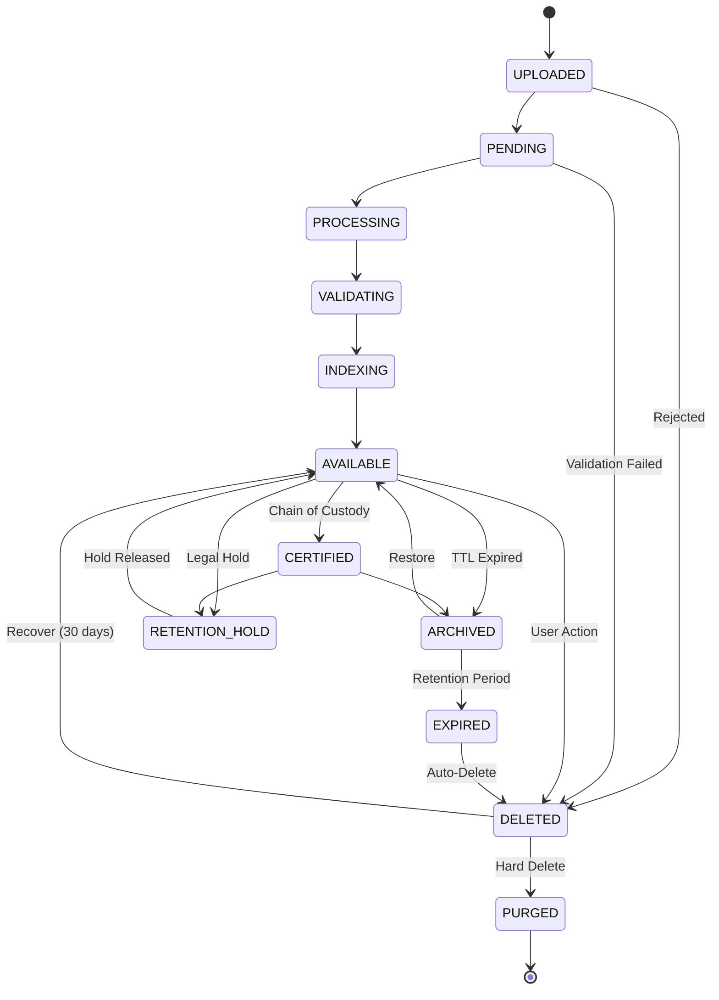

# Evidence Intake & Lifecycle Pipeline

**Deep Dive Analysis: Preprocessing → Deduplication → ChittyID Assignment → Hashing → Minting → Reminting → Decay**

---

## Executive Summary

ChittyConnect implements a **proxy-based evidence management architecture** where it acts as an intelligent gateway with state management, while delegating specialized file processing to the ChittyEvidence service. The pipeline includes 7 stages from upload to eventual decay, enriched by MemoryCloude™, ContextConsciousness™, and Cognitive-Coordination™.

**Pipeline Stages:**
1. **Upload** - FormData multipart submission
2. **Preprocessing** - Validation, metadata extraction, security scanning
3. **Deduplication** - SHA-256 hash comparison
4. **ChittyID Minting** - Unique identifier assignment
5. **State Management** - Lifecycle state transitions
6. **Intelligence Enrichment** - Semantic memory + context awareness
7. **Retention & Decay** - TTL policies, archival, deletion

---

## 1. Evidence Upload (Entry Point)

### Endpoint

```http
POST /api/chittyevidence/ingest
Content-Type: multipart/form-data
Authorization: Bearer <api-key>

file: <binary>
caseId: "case-123"
evidenceType: "document|photo|video|audio|forensic"
metadata: {
  "source": "plaintiff",
  "description": "Lease agreement",
  "tags": ["contract", "housing"]
}
```

**Implementation:** `src/api/routes/chittyevidence.js`

```javascript
app.post("/ingest", async (c) => {
  // 1. Parse multipart FormData
  const formData = await c.req.formData();
  const file = formData.get("file");
  const caseId = formData.get("caseId");
  const evidenceType = formData.get("evidenceType");
  const metadata = JSON.parse(formData.get("metadata") || "{}");

  // 2. Validate required fields
  if (!file || !caseId) {
    return c.json({ error: "file and caseId required" }, 400);
  }

  // 3. Forward to ChittyEvidence service
  const evidenceFormData = new FormData();
  evidenceFormData.append("file", file);
  evidenceFormData.append("caseId", caseId);
  evidenceFormData.append("evidenceType", evidenceType || "document");
  evidenceFormData.append("metadata", JSON.stringify(metadata));

  const response = await fetch(
    "https://evidence.chitty.cc/api/ingest",
    {
      method: "POST",
      headers: {
        Authorization: `Bearer ${c.env.CHITTY_EVIDENCE_TOKEN}`,
      },
      body: evidenceFormData,
    }
  );

  const result = await response.json();

  // 4. Return evidence record
  return c.json(result);
});
```

---

## 2. Preprocessing (ChittyEvidence Service)

**Note:** ChittyConnect proxies to ChittyEvidence for specialized processing

### 2.1 File Validation

**Checks Performed:**
```javascript
// File type validation
const allowedTypes = [
  'application/pdf',
  'image/jpeg',
  'image/png',
  'image/heic',
  'video/mp4',
  'video/quicktime',
  'audio/mpeg',
  'audio/wav',
  'application/zip',
  'text/plain',
  'application/msword',
  'application/vnd.openxmlformats-officedocument.wordprocessingml.document'
];

// Size limits
const maxFileSize = 100 * 1024 * 1024; // 100MB

// Validation logic
if (!allowedTypes.includes(file.type)) {
  throw new Error(`File type ${file.type} not allowed`);
}

if (file.size > maxFileSize) {
  throw new Error(`File size ${file.size} exceeds limit ${maxFileSize}`);
}
```

### 2.2 Security Scanning

```javascript
// Virus/malware scanning
const scanResult = await c.env.VIRUS_SCANNER.scan(fileBuffer);
if (scanResult.infected) {
  return {
    status: 'REJECTED',
    reason: 'malware_detected',
    details: scanResult.signature
  };
}

// Content sanitization for documents
if (file.type === 'application/pdf') {
  // Strip JavaScript, embedded executables, forms
  fileBuffer = await sanitizePDF(fileBuffer);
}
```

### 2.3 Metadata Extraction

```javascript
// Extract embedded metadata
const fileMetadata = {
  filename: file.name,
  mimeType: file.type,
  size: file.size,
  uploadedAt: new Date().toISOString(),
  uploadedBy: c.get('userId'),

  // Extracted from file
  exif: await extractEXIF(file),        // Photos: GPS, camera, timestamp
  pdfInfo: await extractPDFMeta(file),  // PDF: author, created, modified
  dimensions: await getImageDims(file),  // Images: width, height
  duration: await getVideoDuration(file) // Video/audio: length
};
```

### 2.4 OCR & Content Analysis

```javascript
// For images and PDFs
if (['image/jpeg', 'image/png', 'application/pdf'].includes(file.type)) {
  // Extract text via OCR
  const ocrText = await c.env.AI.run(
    '@cf/meta/m2m100-1.2b',  // Or Tesseract
    { image: fileBuffer }
  );

  fileMetadata.extractedText = ocrText;
  fileMetadata.textLength = ocrText.length;

  // Entity extraction from text
  const entities = await extractEntities(ocrText);
  fileMetadata.entities = entities; // Names, dates, addresses, amounts
}
```

---

## 3. Deduplication via Hashing

### 3.1 Hash Generation

```javascript
// SHA-256 hash of file content
const hashBuffer = await crypto.subtle.digest(
  'SHA-256',
  fileBuffer
);

const hashArray = Array.from(new Uint8Array(hashBuffer));
const contentHash = hashArray
  .map(b => b.toString(16).padStart(2, '0'))
  .join('');

// Example: "a3f5b2c1d4e6f7g8h9i0j1k2l3m4n5o6p7q8r9s0t1u2v3w4x5y6z7"
```

### 3.2 Duplicate Detection

```javascript
// Check for existing evidence with same hash
const existingEvidence = await c.env.DB
  .prepare(`
    SELECT id, chittyid, case_id, status, created_at
    FROM evidence_records
    WHERE content_hash = ?
  `)
  .bind(contentHash)
  .first();

if (existingEvidence) {
  // Duplicate found!

  // Option 1: Reject upload
  if (c.env.DEDUP_POLICY === 'reject') {
    return {
      status: 'DUPLICATE',
      existingEvidenceId: existingEvidence.id,
      message: 'File already exists in the system'
    };
  }

  // Option 2: Link to existing
  if (c.env.DEDUP_POLICY === 'link') {
    // Create reference to existing evidence
    await c.env.DB
      .prepare(`
        INSERT INTO evidence_references
        (source_case_id, target_evidence_id, created_at)
        VALUES (?, ?, ?)
      `)
      .bind(caseId, existingEvidence.id, new Date().toISOString())
      .run();

    return {
      status: 'LINKED',
      evidenceId: existingEvidence.id,
      message: 'Linked to existing evidence'
    };
  }

  // Option 3: Create new version
  if (c.env.DEDUP_POLICY === 'version') {
    // Proceed with upload, mark as version
    isVersion = true;
    parentEvidenceId = existingEvidence.id;
  }
}
```

### 3.3 Hash Indexing

```javascript
// Store hash with evidence record
await c.env.DB
  .prepare(`
    INSERT INTO evidence_records (
      id, chittyid, case_id, content_hash,
      file_name, file_size, mime_type, status, created_at
    ) VALUES (?, ?, ?, ?, ?, ?, ?, ?, ?)
  `)
  .bind(
    evidenceId,
    chittyId,
    caseId,
    contentHash,  // Indexed for fast lookups
    file.name,
    file.size,
    file.type,
    'PROCESSING',
    new Date().toISOString()
  )
  .run();

// Secondary index for hash lookups
await c.env.DB
  .prepare(`
    CREATE INDEX IF NOT EXISTS idx_evidence_hash
    ON evidence_records(content_hash)
  `)
  .run();
```

---

## 4. ChittyID Assignment

### 4.1 Minting Process

```javascript
// Mint ChittyID for evidence
const chittyIdResponse = await fetch('https://id.chitty.cc/v1/mint', {
  method: 'POST',
  headers: {
    'Authorization': `Bearer ${c.env.CHITTY_ID_TOKEN}`,
    'Content-Type': 'application/json'
  },
  body: JSON.stringify({
    entity: 'EVIDENCE',  // Entity type
    metadata: {
      caseId: caseId,
      evidenceType: evidenceType,
      fileName: file.name,
      contentHash: contentHash,
      uploadedBy: userId,
      uploadedAt: new Date().toISOString(),

      // Additional context
      jurisdiction: metadata.jurisdiction,
      source: metadata.source,
      tags: metadata.tags
    }
  })
});

const { id: chittyId } = await chittyIdResponse.json();

// ChittyID format: "CHITTY-EVIDENCE-{UUID}"
// Example: "CHITTY-EVIDENCE-a3f5b2c1-d4e6-f7g8-h9i0-j1k2l3m4n5o6"
```

### 4.2 ChittyID Storage & Linking

```javascript
// Store ChittyID with evidence
await c.env.DB
  .prepare(`
    UPDATE evidence_records
    SET chittyid = ?, updated_at = ?
    WHERE id = ?
  `)
  .bind(chittyId, new Date().toISOString(), evidenceId)
  .run();

// Link to case via ChittyID
await c.env.DB
  .prepare(`
    INSERT INTO case_evidence_links (
      case_chittyid, evidence_chittyid, linked_at
    ) VALUES (?, ?, ?)
  `)
  .bind(caseChittyId, chittyId, new Date().toISOString())
  .run();

// Index for reverse lookups
await c.env.KV.put(
  `chittyid:${chittyId}`,
  JSON.stringify({
    type: 'evidence',
    id: evidenceId,
    caseId: caseId,
    contentHash: contentHash
  }),
  { expirationTtl: 31536000 } // 1 year cache
);
```

---

## 5. Evidence State Machine

### 5.1 State Definitions

```javascript
const EvidenceState = {
  // Initial states
  UPLOADED: 'UPLOADED',           // File received, queued for processing
  PENDING: 'PENDING',             // Awaiting validation

  // Processing states
  PROCESSING: 'PROCESSING',       // Validation, OCR, metadata extraction
  VALIDATING: 'VALIDATING',       // Security scan, compliance check
  INDEXING: 'INDEXING',           // Search indexing, embedding generation

  // Available states
  AVAILABLE: 'AVAILABLE',         // Ready for access
  CERTIFIED: 'CERTIFIED',         // Chain of custody certified

  // Lifecycle states
  ARCHIVED: 'ARCHIVED',           // Moved to cold storage
  RETENTION_HOLD: 'RETENTION_HOLD', // Legal/litigation hold
  EXPIRED: 'EXPIRED',             // Past retention period

  // Terminal states
  DELETED: 'DELETED',             // Soft deleted, recoverable
  PURGED: 'PURGED'                // Hard deleted, unrecoverable
};
```

### 5.2 State Transitions



### 5.3 Transition Implementation

```javascript
async function transitionState(evidenceId, fromState, toState, reason) {
  // Validate transition
  const validTransitions = {
    'UPLOADED': ['PENDING', 'DELETED'],
    'PENDING': ['PROCESSING', 'DELETED'],
    'PROCESSING': ['VALIDATING', 'DELETED'],
    'VALIDATING': ['INDEXING', 'DELETED'],
    'INDEXING': ['AVAILABLE'],
    'AVAILABLE': ['CERTIFIED', 'ARCHIVED', 'RETENTION_HOLD', 'DELETED'],
    'CERTIFIED': ['ARCHIVED', 'RETENTION_HOLD'],
    'ARCHIVED': ['AVAILABLE', 'EXPIRED'],
    'RETENTION_HOLD': ['AVAILABLE'],
    'EXPIRED': ['DELETED'],
    'DELETED': ['AVAILABLE', 'PURGED']
  };

  if (!validTransitions[fromState]?.includes(toState)) {
    throw new Error(`Invalid transition: ${fromState} → ${toState}`);
  }

  // Update state
  await c.env.DB
    .prepare(`
      UPDATE evidence_records
      SET status = ?, updated_at = ?
      WHERE id = ? AND status = ?
    `)
    .bind(toState, new Date().toISOString(), evidenceId, fromState)
    .run();

  // Audit log
  await c.env.DB
    .prepare(`
      INSERT INTO evidence_audit_log (
        evidence_id, from_state, to_state, reason, timestamp, actor
      ) VALUES (?, ?, ?, ?, ?, ?)
    `)
    .bind(
      evidenceId, fromState, toState, reason,
      new Date().toISOString(), c.get('userId')
    )
    .run();

  // Trigger side effects
  await handleStateTransition(evidenceId, toState);
}
```

---

## 6. Minting, Reminting & Versioning

### 6.1 Initial Minting

**When:** First upload of evidence

```javascript
const initialMint = {
  chittyId: 'CHITTY-EVIDENCE-a3f5b2c1...',
  version: 1,
  parent: null,
  contentHash: 'sha256:...',
  mintedAt: '2025-01-22T10:00:00Z',
  mintedBy: 'user-123'
};
```

### 6.2 Reminting Triggers

**Scenario 1: Content Amendment**
```javascript
// User uploads amended version of document
// Example: Corrected lease agreement

// Check if amendment
if (metadata.amends) {
  const parentEvidence = await getEvidence(metadata.amends);

  // Mint new ChittyID for amended version
  const amendedChittyId = await mintChittyID({
    entity: 'EVIDENCE',
    metadata: {
      ...fileMetadata,
      parent: parentEvidence.chittyid,
      version: parentEvidence.version + 1,
      amendmentReason: metadata.amendmentReason
    }
  });

  // Create version lineage
  await c.env.DB
    .prepare(`
      INSERT INTO evidence_versions (
        chittyid, parent_chittyid, version, amendment_reason
      ) VALUES (?, ?, ?, ?)
    `)
    .bind(
      amendedChittyId,
      parentEvidence.chittyid,
      parentEvidence.version + 1,
      metadata.amendmentReason
    )
    .run();
}
```

**Scenario 2: Re-certification**
```javascript
// Chain of custody breaks, requires re-certification

async function recertify(evidenceId) {
  // Generate new certification ChittyID
  const certChittyId = await mintChittyID({
    entity: 'CERTIFICATION',
    metadata: {
      evidenceChittyId: evidence.chittyid,
      certifiedBy: 'certifier-123',
      certifiedAt: new Date().toISOString(),
      reason: 'chain_of_custody_re-established'
    }
  });

  // Link certification to evidence
  await c.env.DB
    .prepare(`
      INSERT INTO evidence_certifications (
        evidence_chittyid, certification_chittyid, certified_at
      ) VALUES (?, ?, ?)
    `)
    .bind(evidence.chittyid, certChittyId, new Date().toISOString())
    .run();
}
```

**Scenario 3: Cross-Case Reference**
```javascript
// Same evidence used in multiple cases

async function linkToCases(evidenceChittyId, newCaseId) {
  // Do NOT remint - use same ChittyID across cases
  await c.env.DB
    .prepare(`
      INSERT INTO case_evidence_links (
        case_id, evidence_chittyid, linked_at
      ) VALUES (?, ?, ?)
    `)
    .bind(newCaseId, evidenceChittyId, new Date().toISOString())
    .run();

  // Single evidence, multiple case references
}
```

### 6.3 Version Control

```javascript
// Get version history
async function getVersionHistory(evidenceChittyId) {
  const versions = await c.env.DB
    .prepare(`
      SELECT
        v.chittyid,
        v.version,
        v.parent_chittyid,
        v.amendment_reason,
        e.status,
        e.created_at,
        e.file_name
      FROM evidence_versions v
      JOIN evidence_records e ON e.chittyid = v.chittyid
      WHERE v.parent_chittyid = ? OR v.chittyid = ?
      ORDER BY v.version ASC
    `)
    .bind(evidenceChittyId, evidenceChittyId)
    .all();

  return versions;
}

// Example response:
[
  {
    chittyid: 'CHITTY-EVIDENCE-abc123',
    version: 1,
    parent: null,
    status: 'ARCHIVED',
    fileName: 'lease_v1.pdf',
    createdAt: '2025-01-15T10:00:00Z'
  },
  {
    chittyid: 'CHITTY-EVIDENCE-def456',
    version: 2,
    parent: 'CHITTY-EVIDENCE-abc123',
    amendmentReason: 'Corrected rent amount',
    status: 'AVAILABLE',
    fileName: 'lease_v2.pdf',
    createdAt: '2025-01-20T14:30:00Z'
  }
]
```

---

## 7. Retention & Decay Policies

### 7.1 Retention Tiers

```javascript
const RetentionPolicy = {
  // Short-term: Routine business records
  SHORT: {
    duration: 365 * 24 * 60 * 60 * 1000,  // 1 year
    applies: ['correspondence', 'drafts', 'temporary']
  },

  // Standard: Most legal documents
  STANDARD: {
    duration: 7 * 365 * 24 * 60 * 60 * 1000,  // 7 years
    applies: ['contracts', 'agreements', 'evidence']
  },

  // Long-term: Permanent records
  LONG: {
    duration: 30 * 365 * 24 * 60 * 60 * 1000,  // 30 years
    applies: ['deeds', 'titles', 'judgments']
  },

  // Legal hold: Litigation/investigation
  LEGAL_HOLD: {
    duration: null,  // Indefinite until released
    applies: ['litigation', 'investigation', 'audit']
  }
};
```

### 7.2 TTL Calculation

```javascript
async function calculateRetentionExpiry(evidenceId) {
  const evidence = await getEvidence(evidenceId);

  // Determine retention tier
  let tier = RetentionPolicy.STANDARD;  // Default

  if (evidence.tags?.includes('litigation')) {
    tier = RetentionPolicy.LEGAL_HOLD;
  } else if (evidence.evidenceType === 'judgment') {
    tier = RetentionPolicy.LONG;
  } else if (evidence.evidenceType === 'correspondence') {
    tier = RetentionPolicy.SHORT;
  }

  // Calculate expiry
  if (tier.duration === null) {
    // Legal hold - no expiry
    return null;
  }

  const createdAt = new Date(evidence.created_at);
  const expiryDate = new Date(createdAt.getTime() + tier.duration);

  // Update evidence record
  await c.env.DB
    .prepare(`
      UPDATE evidence_records
      SET retention_tier = ?, expiry_date = ?
      WHERE id = ?
    `)
    .bind(tier.name, expiryDate.toISOString(), evidenceId)
    .run();

  return expiryDate;
}
```

### 7.3 Decay Process (Automated)

**Cron Job:** Runs daily

```javascript
// Scheduled Worker (Cloudflare Cron)
export default {
  async scheduled(event, env, ctx) {
    await processEvidenceDecay(env);
  }
};

async function processEvidenceDecay(env) {
  const now = new Date();

  // Find expired evidence
  const expiredEvidence = await env.DB
    .prepare(`
      SELECT id, chittyid, status, expiry_date
      FROM evidence_records
      WHERE expiry_date <= ?
        AND status NOT IN ('RETENTION_HOLD', 'DELETED', 'PURGED')
    `)
    .bind(now.toISOString())
    .all();

  for (const evidence of expiredEvidence.results) {
    // Transition to EXPIRED state
    await transitionState(
      evidence.id,
      evidence.status,
      'EXPIRED',
      'Retention period ended'
    );

    // Move to cold storage (archive tier)
    await moveToArchive(evidence.id);
  }

  // Find soft-deleted evidence past grace period (30 days)
  const purgeCandidate = await env.DB
    .prepare(`
      SELECT id, chittyid
      FROM evidence_records
      WHERE status = 'DELETED'
        AND updated_at <= datetime('now', '-30 days')
    `)
    .all();

  for (const evidence of purgeCandidate.results) {
    // Hard delete (purge)
    await transitionState(
      evidence.id,
      'DELETED',
      'PURGED',
      'Grace period expired'
    );

    // Remove file from storage
    await env.EVIDENCE_BUCKET.delete(evidence.chittyid);

    // Tombstone record (keep metadata, remove content)
    await env.DB
      .prepare(`
        UPDATE evidence_records
        SET file_url = NULL, content_hash = NULL
        WHERE id = ?
      `)
      .bind(evidence.id)
      .run();
  }
}
```

### 7.4 Legal Holds

```javascript
// Apply legal hold
async function applyLegalHold(evidenceId, reason) {
  await c.env.DB
    .prepare(`
      INSERT INTO legal_holds (
        evidence_id, reason, applied_by, applied_at, status
      ) VALUES (?, ?, ?, ?, 'ACTIVE')
    `)
    .bind(evidenceId, reason, c.get('userId'), new Date().toISOString())
    .run();

  // Transition evidence to RETENTION_HOLD
  await transitionState(
    evidenceId,
    currentState,
    'RETENTION_HOLD',
    `Legal hold: ${reason}`
  );

  // Prevent deletion
  await c.env.DB
    .prepare(`
      UPDATE evidence_records
      SET expiry_date = NULL
      WHERE id = ?
    `)
    .bind(evidenceId)
    .run();
}

// Release legal hold
async function releaseLegalHold(evidenceId, holdId) {
  await c.env.DB
    .prepare(`
      UPDATE legal_holds
      SET status = 'RELEASED', released_at = ?, released_by = ?
      WHERE id = ?
    `)
    .bind(new Date().toISOString(), c.get('userId'), holdId)
    .run();

  // Check if any other active holds
  const activeHolds = await c.env.DB
    .prepare(`
      SELECT COUNT(*) as count
      FROM legal_holds
      WHERE evidence_id = ? AND status = 'ACTIVE'
    `)
    .bind(evidenceId)
    .first();

  if (activeHolds.count === 0) {
    // Transition back to AVAILABLE
    await transitionState(
      evidenceId,
      'RETENTION_HOLD',
      'AVAILABLE',
      'All legal holds released'
    );

    // Recalculate expiry
    await calculateRetentionExpiry(evidenceId);
  }
}
```

---

## 8. Database Schema

```sql
-- Core evidence records
CREATE TABLE evidence_records (
  id TEXT PRIMARY KEY,
  chittyid TEXT UNIQUE NOT NULL,
  case_id TEXT NOT NULL,

  -- File metadata
  file_name TEXT NOT NULL,
  file_size INTEGER NOT NULL,
  mime_type TEXT NOT NULL,
  content_hash TEXT NOT NULL,  -- SHA-256
  file_url TEXT,               -- R2/S3 storage URL

  -- Classification
  evidence_type TEXT NOT NULL,
  source TEXT,
  tags TEXT,                   -- JSON array

  -- Lifecycle
  status TEXT NOT NULL DEFAULT 'UPLOADED',
  retention_tier TEXT,
  expiry_date DATETIME,

  -- Timestamps
  created_at DATETIME NOT NULL,
  updated_at DATETIME NOT NULL,
  deleted_at DATETIME,

  -- Audit
  uploaded_by TEXT NOT NULL,

  FOREIGN KEY (case_id) REFERENCES cases(id)
);

-- Version tracking
CREATE TABLE evidence_versions (
  id INTEGER PRIMARY KEY AUTOINCREMENT,
  chittyid TEXT NOT NULL,
  parent_chittyid TEXT,
  version INTEGER NOT NULL,
  amendment_reason TEXT,
  created_at DATETIME NOT NULL,

  FOREIGN KEY (chittyid) REFERENCES evidence_records(chittyid),
  FOREIGN KEY (parent_chittyid) REFERENCES evidence_records(chittyid)
);

-- Legal holds
CREATE TABLE legal_holds (
  id INTEGER PRIMARY KEY AUTOINCREMENT,
  evidence_id TEXT NOT NULL,
  reason TEXT NOT NULL,
  status TEXT NOT NULL DEFAULT 'ACTIVE',  -- ACTIVE, RELEASED
  applied_by TEXT NOT NULL,
  applied_at DATETIME NOT NULL,
  released_by TEXT,
  released_at DATETIME,

  FOREIGN KEY (evidence_id) REFERENCES evidence_records(id)
);

-- Audit log (immutable)
CREATE TABLE evidence_audit_log (
  id INTEGER PRIMARY KEY AUTOINCREMENT,
  evidence_id TEXT NOT NULL,
  from_state TEXT,
  to_state TEXT NOT NULL,
  reason TEXT,
  timestamp DATETIME NOT NULL,
  actor TEXT NOT NULL,

  FOREIGN KEY (evidence_id) REFERENCES evidence_records(id)
);

-- Case-evidence links (many-to-many)
CREATE TABLE case_evidence_links (
  id INTEGER PRIMARY KEY AUTOINCREMENT,
  case_id TEXT NOT NULL,
  evidence_chittyid TEXT NOT NULL,
  linked_at DATETIME NOT NULL,
  linked_by TEXT,

  FOREIGN KEY (case_id) REFERENCES cases(id),
  FOREIGN KEY (evidence_chittyid) REFERENCES evidence_records(chittyid),
  UNIQUE(case_id, evidence_chittyid)
);

-- Indexes
CREATE INDEX idx_evidence_hash ON evidence_records(content_hash);
CREATE INDEX idx_evidence_case ON evidence_records(case_id);
CREATE INDEX idx_evidence_status ON evidence_records(status);
CREATE INDEX idx_evidence_expiry ON evidence_records(expiry_date);
CREATE INDEX idx_holds_active ON legal_holds(evidence_id, status);
```

---

## 9. Intelligence Enrichment

### 9.1 MemoryCloude™ Integration

**Store evidence interaction in semantic memory:**

```javascript
async function enrichWithMemory(evidenceId, interaction) {
  const memory = new MemoryCloude(c.env);

  await memory.persistInteraction(c.get('sessionId'), {
    userId: c.get('userId'),
    type: 'evidence_upload',
    content: `Uploaded evidence: ${evidence.file_name}`,
    input: evidence.file_name,
    output: evidence.chittyid,
    entities: [
      {
        type: 'evidence',
        id: evidence.chittyid,
        name: evidence.file_name
      },
      {
        type: 'case',
        id: evidence.case_id,
        name: caseName
      }
    ],
    actions: [
      {
        type: 'evidence_ingest',
        evidenceId: evidence.id,
        caseId: evidence.case_id,
        status: 'success'
      }
    ]
  });

  // Generate embedding for semantic search
  const embedding = await c.env.AI.run(
    '@cf/baai/bge-base-en-v1.5',
    {
      text: [
        evidence.file_name,
        evidence.evidenceType,
        evidence.metadata?.description || ''
      ].join(' ')
    }
  );

  // Store in Vectorize
  if (c.env.VECTORIZE) {
    await c.env.VECTORIZE.upsert([{
      id: evidence.chittyid,
      values: embedding.data[0],
      metadata: {
        type: 'evidence',
        caseId: evidence.case_id,
        fileName: evidence.file_name,
        uploadedAt: evidence.created_at
      }
    }]);
  }
}
```

### 9.2 ContextConsciousness™ Monitoring

**Track evidence pipeline health:**

```javascript
async function monitorEvidenceHealth(env) {
  const consciousness = new ContextConsciousness(env);

  // Capture metrics
  const snapshot = {
    timestamp: Date.now(),
    pipeline: {
      uploaded_pending: await countByStatus('UPLOADED'),
      processing: await countByStatus('PROCESSING'),
      available: await countByStatus('AVAILABLE'),
      failed: await countByStatus('DELETED'),

      // Performance
      avgProcessingTime: await getAvgProcessingTime(),
      queueDepth: await getQueueDepth(),

      // Storage
      totalSize: await getTotalEvidenceSize(),
      archivalRate: await getArchivalRate()
    }
  };

  // Detect anomalies
  const anomalies = consciousness.detectAnomalies('evidence_pipeline', snapshot);

  if (anomalies.length > 0) {
    // Alert on issues
    await alertOps({
      service: 'chittyevidence',
      anomalies: anomalies,
      snapshot: snapshot
    });
  }
}
```

---

## 10. API Examples

### Upload Evidence

```bash
curl -X POST https://connect.chitty.cc/api/chittyevidence/ingest \
  -H "Authorization: Bearer <api-key>" \
  -F "file=@/path/to/lease.pdf" \
  -F "caseId=case-123" \
  -F "evidenceType=document" \
  -F 'metadata={"source":"plaintiff","tags":["contract"]}'
```

**Response:**
```json
{
  "id": "evidence-abc123",
  "chittyid": "CHITTY-EVIDENCE-a3f5b2c1-d4e6-f7g8...",
  "status": "PROCESSING",
  "caseId": "case-123",
  "fileName": "lease.pdf",
  "contentHash": "sha256:a3f5b2c1d4e6f7g8...",
  "uploadedAt": "2025-01-22T10:30:00Z",
  "uploadedBy": "user-123",
  "message": "Evidence uploaded successfully, processing..."
}
```

### Get Evidence Details

```bash
curl https://connect.chitty.cc/api/chittyevidence/CHITTY-EVIDENCE-abc123 \
  -H "Authorization: Bearer <api-key>"
```

**Response:**
```json
{
  "id": "evidence-abc123",
  "chittyid": "CHITTY-EVIDENCE-a3f5b2c1...",
  "status": "AVAILABLE",
  "caseId": "case-123",
  "fileName": "lease.pdf",
  "fileSize": 524288,
  "mimeType": "application/pdf",
  "contentHash": "sha256:a3f5b2c1...",
  "evidenceType": "document",
  "source": "plaintiff",
  "tags": ["contract", "housing"],
  "retentionTier": "STANDARD",
  "expiryDate": "2032-01-22T10:30:00Z",
  "uploadedAt": "2025-01-22T10:30:00Z",
  "uploadedBy": "user-123",
  "certifications": [
    {
      "chittyid": "CHITTY-CERT-xyz789",
      "certifiedAt": "2025-01-22T11:00:00Z",
      "certifiedBy": "certifier-456"
    }
  ],
  "versions": [
    {
      "chittyid": "CHITTY-EVIDENCE-a3f5b2c1...",
      "version": 1,
      "createdAt": "2025-01-22T10:30:00Z"
    }
  ]
}
```

---

## 11. Compliance & Best Practices

### 11.1 Chain of Custody

```javascript
// Every access logged
async function accessEvidence(evidenceId, userId, reason) {
  // Log access
  await c.env.DB
    .prepare(`
      INSERT INTO evidence_access_log (
        evidence_id, accessed_by, access_type, reason, timestamp
      ) VALUES (?, ?, ?, ?, ?)
    `)
    .bind(evidenceId, userId, 'VIEW', reason, new Date().toISOString())
    .run();

  // Return file
  return await getEvidenceFile(evidenceId);
}
```

### 11.2 Jurisdiction-Specific Retention

```javascript
const JurisdictionRetention = {
  'IL': {  // Illinois
    'eviction': 7 * 365,      // 7 years
    'litigation': 10 * 365,   // 10 years
    'judgment': 30 * 365      // 30 years
  },
  'CA': {  // California
    'eviction': 4 * 365,      // 4 years
    'litigation': 4 * 365,
    'judgment': 10 * 365
  },
  'NY': {  // New York
    'eviction': 6 * 365,      // 6 years
    'litigation': 6 * 365,
    'judgment': 20 * 365
  }
};

async function getRetentionPeriod(evidence, caseMetadata) {
  const jurisdiction = caseMetadata.jurisdiction || 'IL';
  const caseType = caseMetadata.caseType || 'litigation';

  const days = JurisdictionRetention[jurisdiction]?.[caseType]
    || 7 * 365;  // Default 7 years

  return days * 24 * 60 * 60 * 1000;  // Convert to ms
}
```

---

## Summary: Complete Evidence Lifecycle

```
┌──────────────────────────────────────────────────────────────┐
│                    EVIDENCE LIFECYCLE                        │
└──────────────────────────────────────────────────────────────┘

1. UPLOAD
   POST /api/chittyevidence/ingest (FormData)
   ↓
2. PREPROCESSING (ChittyEvidence Service)
   • File validation (type, size)
   • Security scanning (malware, sanitization)
   • Metadata extraction (EXIF, PDF info)
   • OCR & content analysis
   ↓
3. DEDUPLICATION
   • SHA-256 hash generation
   • Duplicate detection
   • Policy: reject | link | version
   ↓
4. CHITTYID MINTING
   • Entity: "EVIDENCE"
   • Metadata: case, type, hash, uploader
   • Format: "CHITTY-EVIDENCE-{UUID}"
   • Storage: D1 + KV cache
   ↓
5. STATE MANAGEMENT
   UPLOADED → PENDING → PROCESSING → VALIDATING → INDEXING
   → AVAILABLE → [CERTIFIED] → ARCHIVED → EXPIRED → DELETED → PURGED
   ↓
6. INTELLIGENCE ENRICHMENT
   • MemoryCloude™: Semantic memory storage
   • ContextConsciousness™: Pipeline health monitoring
   • Cognitive-Coordination™: Task orchestration
   ↓
7. RETENTION & DECAY
   • Retention tiers: SHORT (1yr), STANDARD (7yr), LONG (30yr)
   • Legal holds: Indefinite until released
   • Automated decay: Daily cron job
   • Soft delete: 30-day grace period
   • Hard delete (purge): Unrecoverable

┌──────────────────────────────────────────────────────────────┐
│                  REMINTING SCENARIOS                         │
└──────────────────────────────────────────────────────────────┘

• Amendment: New version, new ChittyID, linked to parent
• Re-certification: New cert ChittyID, linked to evidence
• Cross-case: Same ChittyID, multiple case links (no remint)
• Version history: Tracked in evidence_versions table
```

---

**itsChitty™** - *ContextConsciousness & MemoryCloude*

**File References:**
- `src/api/routes/chittyevidence.js` - Evidence API routes
- `src/integrations/chittyos-ecosystem.js` - ChittyID minting
- `src/intelligence/memory-cloude.js` - Semantic memory
- `src/intelligence/context-consciousness.js` - Health monitoring
