# ChittyConnect Workflow Diagrams

## 1. Deploy Pipeline Workflow

```mermaid
graph TD
    A[Push to main/staging] --> B{Branch?}
    B -->|main| C[Lint & Test Job]
    B -->|staging| C

    C --> D[Checkout Code]
    D --> E[Setup Node.js 18]
    E --> F[Install Dependencies]
    F --> G[Run Lint]
    G --> H[Format Check]
    H --> I[Run Tests]

    I -->|Success| J{Which Branch?}
    I -->|Failure| Z[❌ Fail Pipeline]

    J -->|main| K[Deploy Production Job]
    J -->|staging| L[Deploy Staging Job]

    K --> K1[Validate OpenAPI]
    K1 --> K2[Deploy to connect.chitty.cc]
    K2 --> K3[Health Check /health]
    K3 --> K4[Check /openapi.json]
    K4 --> K5[Check /mcp/manifest]
    K5 --> K6[✅ Success]

    L --> L1[Deploy to staging.chitty.workers.dev]
    L1 --> L2[Health Check]
    L2 --> L3[✅ Success]

    K2 -->|Failure| Z
    K3 -->|Failure| Z
    L1 -->|Failure| Z
```



## 2. PR Check Workflow

```mermaid
graph TD
    A[PR Opened/Updated] --> B[Checkout with Full History]
    B --> C[Setup Node.js]
    C --> D[Validate PR Title]

    D --> E{Conventional Commits?}
    E -->|No| F[❌ Fail: Invalid Title]
    E -->|Yes| G[✅ Title Valid]

    G --> H[Analyze File Changes]
    H --> I[Show Changed Files]
    I --> J[Show Lines Changed Stats]

    J --> K[Check for TODO/FIXME]
    K --> L{New TODOs Found?}
    L -->|Yes| M[⚠️ Warning: New TODOs]
    L -->|No| N[✅ No New TODOs]

    M --> O[Install Dependencies]
    N --> O

    O --> P[Check Bundle Size]
    P --> Q{Source Code Changed?}
    Q -->|Yes| R{Docs Updated?}
    Q -->|No| S[✅ No Docs Needed]

    R -->|Yes| T[✅ Docs Updated]
    R -->|No| U[⚠️ Consider Updating Docs]

    T --> V[✅ PR Checks Complete]
    S --> V
    U --> V
```



## 3. Test & Validate Workflow

```mermaid
graph TD
    A[Push to Feature Branch / PR] --> B[Checkout Code]
    B --> C[Setup Node.js]
    C --> D[Install Dependencies]

    D --> E[Validate wrangler.toml]
    E -->|Missing| F[❌ Fail]
    E -->|Exists| G[✅ Valid]

    G --> H[Check Required Files]
    H --> I{package.json exists?}
    I -->|No| F
    I -->|Yes| J{src/index.js exists?}

    J -->|No| F
    J -->|Yes| K{wrangler.toml exists?}

    K -->|No| F
    K -->|Yes| L[✅ All Files Present]

    L --> M[Security Scan: npm audit]
    M --> N{Critical Vulnerabilities?}
    N -->|Yes| F
    N -->|No| O[✅ Security OK]

    O --> P[Check for Hardcoded Secrets]
    P --> Q{Secrets Found?}
    Q -->|Yes| F
    Q -->|No| R[✅ No Secrets]

    R --> S[Run Tests]
    S --> T[Run Lint]
    T --> U[Smoke Test: Import Check]

    U -->|Success| V[✅ All Validations Pass]
    U -->|Failure| F
```



## 4. ChittyConnect Request Flow

```mermaid
graph LR
    A[Custom GPT / Claude] --> B{Endpoint Type?}

    B -->|REST API| C[/api/* Router]
    B -->|MCP| D[/mcp/* Server]
    B -->|GitHub Webhook| E[/webhook Handler]

    C --> C1[Auth Middleware]
    C1 --> C2{API Key Valid?}
    C2 -->|No| C3[401 Unauthorized]
    C2 -->|Yes| C4[Rate Limit Check]

    C4 --> C5{Rate Limit OK?}
    C5 -->|No| C6[429 Too Many Requests]
    C5 -->|Yes| C7[Route to Service]

    C7 --> C8{Which Service?}
    C8 -->|ChittyID| I1[ChittyID Service]
    C8 -->|ChittyCases| I2[ChittyCases Service]
    C8 -->|ChittyFinance| I3[ChittyFinance Service]
    C8 -->|ChittyEvidence| I4[ChittyEvidence Service]
    C8 -->|ChittyContextual| I5[ChittyContextual Service]
    C8 -->|ThirdParty| I6[Notion/OpenAI/etc]

    I1 --> R[Response + Chronicle Log]
    I2 --> R
    I3 --> R
    I4 --> R
    I5 --> R
    I6 --> R

    D --> D1[MCP Protocol Handler]
    D1 --> D2{Request Type?}
    D2 -->|tools/list| D3[Return Available Tools]
    D2 -->|tools/call| D4[Execute MCP Tool]
    D2 -->|resources/read| D5[Return Resource Data]

    D4 --> D6[ChittyOS Integration]
    D6 --> R

    E --> E1[Verify Webhook Signature]
    E1 --> E2{Valid Signature?}
    E2 -->|No| E3[403 Forbidden]
    E2 -->|Yes| E4[Queue to github-events]
    E4 --> E5[✅ 202 Accepted]
```

## 5. MCP Tool Execution Flow

```mermaid
graph TD
    A[Claude Invokes MCP Tool] --> B[POST /mcp/tools/call]
    B --> C{Which Tool?}

    C -->|chittyid_mint| D[ChittyID Integration]
    C -->|chitty_case_create| E[ChittyCases Integration]
    C -->|chitty_contextual_analyze| F[ChittyContextual Integration]
    C -->|chitty_finance_connect_bank| G[ChittyFinance Integration]
    C -->|chitty_services_status| H[Service Health Check]

    D --> D1[Call https://id.chitty.cc/mint]
    D1 --> D2[ContextConsciousness™ Enrichment]
    D2 --> D3[Chronicle Event Log]
    D3 --> D4[Return ChittyID + Context]

    E --> E1[Call ChittyCases API]
    E1 --> E2[Link to ChittyID]
    E2 --> E3[MemoryCloude™ Store]
    E3 --> E4[Return Case Data]

    F --> F1[Extract Entities]
    F1 --> F2[Analyze Relationships]
    F2 --> F3[Cross-Service Context Lookup]
    F3 --> F4[Return Analysis + Metadata]

    G --> G1[Validate Bank Connection]
    G1 --> G2[Plaid/Stripe Integration]
    G2 --> G3[Store Securely]
    G3 --> G4[Return Connection Status]

    H --> H1[Query ChittyRegistry]
    H1 --> H2[Ping All Services]
    H2 --> H3[Aggregate Health Data]
    H3 --> H4[Return Service Matrix]

    D4 --> I[MCP Response to Claude]
    E4 --> I
    F4 --> I
    G4 --> I
    H4 --> I
```



## 6. GitHub Webhook Processing Flow

```mermaid
graph TD
    A[GitHub Event] --> B[POST /webhook]
    B --> C[Verify Webhook Secret]
    C -->|Invalid| D[403 Forbidden]
    C -->|Valid| E[Parse Event Type]

    E --> F{Event Type?}
    F -->|pull_request| G[PR Event Handler]
    F -->|push| H[Push Event Handler]
    F -->|issues| I[Issue Event Handler]
    F -->|Other| J[Generic Handler]

    G --> G1[Check PR Action]
    G1 --> G2{Action?}
    G2 -->|opened| G3[Add Labels]
    G2 -->|synchronize| G4[Update Checks]
    G2 -->|ready_for_review| G5[Request Reviewers]

    G3 --> K[Queue Event]
    G4 --> K
    G5 --> K

    H --> H1[Check Branch]
    H1 --> H2{Branch?}
    H2 -->|main| H3[Post Deploy Comment]
    H2 -->|Other| H4[Log Event]

    H3 --> K
    H4 --> K

    I --> I1[Check Issue Type]
    I1 --> I2{Type?}
    I2 -->|bug| I3[Add Priority Label]
    I2 -->|feature| I4[Add Enhancement Label]

    I3 --> K
    I4 --> K
    J --> K

    K[github-events Queue] --> L[Background Consumer]
    L --> M[Normalize to MCP Format]
    M --> N[Store in ChittyChronicle]
    N --> O[Trigger Intelligence Analysis]
    O --> P[Update ContextConsciousness™]
    P --> Q[✅ Event Processed]
```



## 7. ContextConsciousness™ State Management


## 8. Service Health Monitoring Flow

```mermaid
graph LR
    A[Health Check Request] --> B[Query ChittyRegistry]
    B --> C[Get Service List]

    C --> D[Parallel Service Pings]
    D --> E1[ChittyID /health]
    D --> E2[ChittyCases /health]
    D --> E3[ChittyFinance /health]
    D --> E4[ChittyEvidence /health]
    D --> E5[ChittyContextual /health]
    D --> E6[ChittySync /health]

    E1 --> F{Response Time?}
    E2 --> F
    E3 --> F
    E4 --> F
    E5 --> F
    E6 --> F

    F -->|<500ms| G[✅ Healthy]
    F -->|500-2000ms| H[⚠️ Degraded]
    F -->|>2000ms or Error| I[❌ Down]

    G --> J[Aggregate Results]
    H --> J
    I --> J

    J --> K[Calculate Overall Health %]
    K --> L{Overall Status?}
    L -->|>90%| M[🟢 System Healthy]
    L -->|50-90%| N[🟡 Partial Outage]
    L -->|<50%| O[🔴 Major Outage]

    M --> P[Return Status Matrix]
    N --> P
    O --> P
```



## 9. Error Handling & Recovery Flow


---

## Legend

- **🟢 Green Checkmarks (✅)** - Success paths
- **🔴 Red X (❌)** - Failure/error states
- **🟡 Warning (⚠️)** - Caution/degraded states
- **Diamond shapes** - Decision points
- **Rectangles** - Actions/processes
- **Rounded rectangles** - Start/end points

---

**Generated for ChittyConnect v1.0.0**
*itsChitty™ - ContextConsciousness & MemoryCloude*
